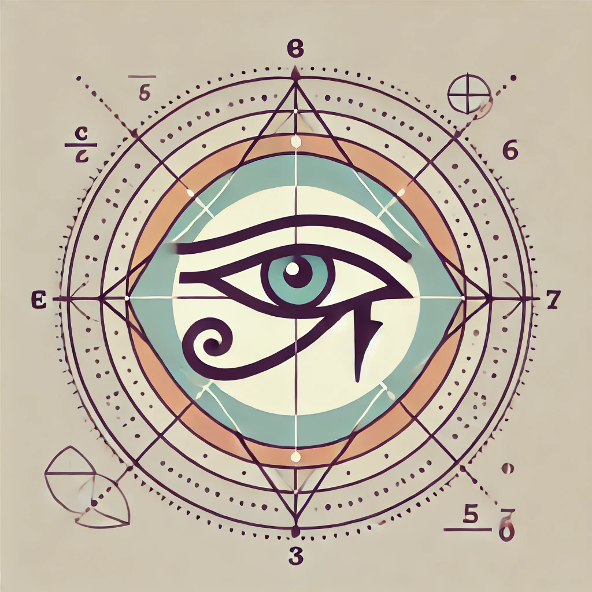

# Deep-Hierarchical-Active-Inference

[](https://opensource.org/licenses/MIT) 



Implementation of Hierarchical Active Inference Agent for perception, planning, and action in OpenAI gym environments

### Running

```
git clone https://github.com/PascalPolygon/Deep-Hierarchical-Active-Inference.git
cd Deep-Hierarchical-Active-Inference
python src/scripts/train.py --config_name="mountain_car" --logdir="mountain_car" --strategy="information" --seed=0
```
